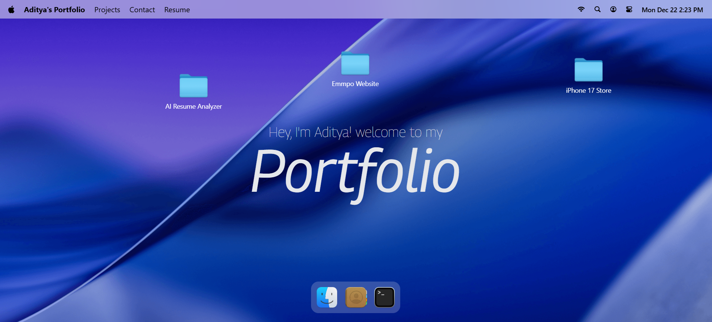

# 🍎 MacOS Portfolio

<div align="center">
  <br />
    <a href="https://github.com/yourusername/macos-portfolio" target="_blank">
      
    </a>
  <br />

  <div>
    
    
    
    
    
  </div>

  <h3 align="center">A Web-Based macOS Experience built with React</h3>

   <div align="center">
     Review the code, star the repo, and enjoy the experience! 🚀
   </div>
</div>

## 📋 Table of Contents

1. [🤖 Introduction](#-introduction)
2. [✨ Features](#-features)
3. [🛠️ Tech Stack](#-tech-stack)
4. [🚀 Getting Started](#-getting-started)
5. [📂 Project Structure](#-project-structure)

## 🤖 Introduction

**MacOS Portfolio** is a highly interactive personal portfolio website that replicates the look and feel of the macOS desktop environment. Built with modern web technologies, it features a functional dock, draggable windows, and simulated applications, providing a unique and engaging user experience.

This project showcases advanced frontend skills including complex state management, animations, and component styling.

## ✨ Features

- **🖥️ Realistic Desktop Interface**: A pixel-perfect recreation of the macOS desktop environment.
- **⚓ Interactive Dock**: Fully animated dock with hover effects using GSAP.
- **🖱️ Draggable Windows**: Open, close, minimize, and move windows around freely.
- **📂 Functional Apps**:
  - **Finder**: Navigate through a simulated file system.
  - **Terminal**: A working command-line interface simulation.
  - **Safari**: A browser simulation to view projects.
  - **Resume**: Integrated PDF viewer to display your CV.
  - **Text Editor**: View and read text files.
  - **Photos**: Image viewer component.
  - **Contact**: Easy way to reach out.
- **🎨 Dynamic Themes & Animations**: Smooth transitions and sleek UI design powered by TailwindCSS and GSAP.

## 🛠️ Tech Stack

- **Frontend Framework**: [React 19](https://react.dev/)
- **Build Tool**: [Vite](https://vitejs.dev/)
- **Styling**: [Tailwind CSS 4](https://tailwindcss.com/)
- **State Management**: [Zustand](https://zustand-demo.pmnd.rs/)
- **Animations**: [GSAP](https://greensock.com/gsap/)
- **Icons**: [Lucide React](https://lucide.dev/)
- **PDF Rendering**: [React-PDF](https://react-pdf.org/)
- **Date Handling**: [Day.js](https://day.js.org/)

## 🚀 Getting Started

Follow these steps to run the project locally on your machine.

### Prerequisites

Make sure you have [Node.js](https://nodejs.org/) installed.

### Installation

1. **Clone the repository**
   ```bash
   git clone https://github.com/yourusername/macos-portfolio.git
   cd macos-portfolio
   ```

2. **Install Dependencies**
   ```bash
   npm install
   ```

3. **Start the Development Server**
   ```bash
   npm run dev
   ```

4. **Open in Browser**
   Visit `http://localhost:5173` to view the app.

## 📂 Project Structure

```bash
src/
├── components/      # Shared UI components (Dock, Navbar, etc.)
├── constants/       # Static data and configuration
├── hoc/             # Higher-Order Components (Window Wrappers)
├── store/           # Zustand state stores
├── windows/         # Application components (Finder, Safari, Terminal, etc.)
├── App.jsx          # Main application entry
└── main.jsx         # React DOM rendering
```

<div align="center">
  Made with ❤️ by Aditya Kumar
</div>
